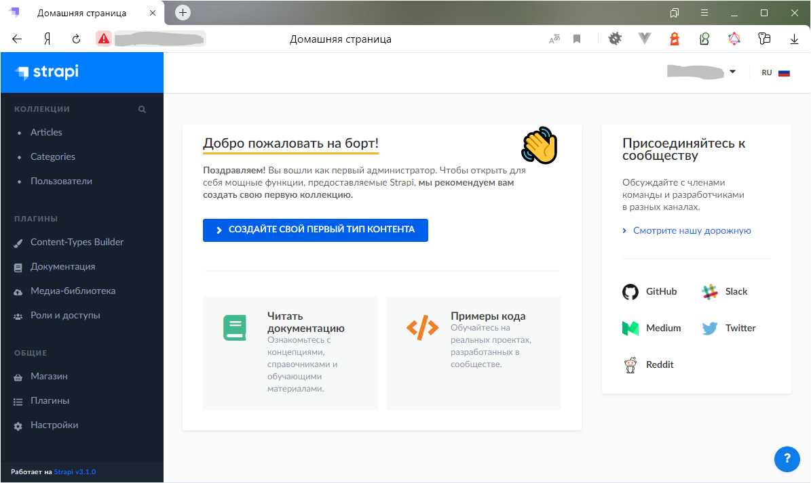
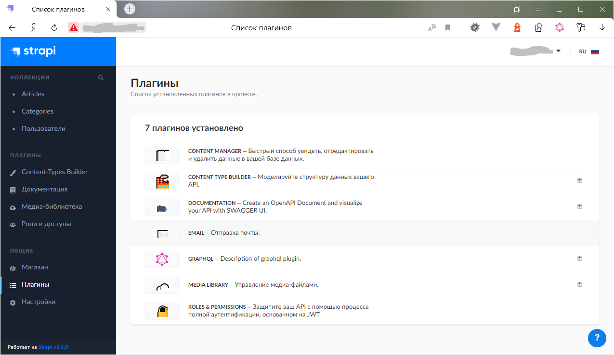

# Быстрый старт Strapi

На основе этого репозитория вы быстро поднимете блог на Strapi v3.1.0.
 
* 2 статьи с картинками
* 2 категории
* 7 предустановленных плагинов
* интерфейс на русском языке

---  

---  

### Необходимые условия

* mysql: 8.0.22
* node: v12.19.1
* npm: 6.14.8
* yarn: 1.22.5

### Настройка nginx  

Заменить содержимое `location/` файла виртуального хоста на следующее  

>proxy_pass http://localhost:1337;  
>proxy_http_version 1.1;  
>proxy_set_header Upgrade $http_upgrade;  
>proxy_set_header Connection 'upgrade';  
>proxy_set_header Host $host;  
>proxy_cache_bypass $http_upgrade;

### Создание базы данных и пользователя  

>CREATE DATABASE `strapi`;  
>CREATE USER `strapi`@`localhost` IDENTIFIED BY '123strapi';  
>GRANT ALL PRIVILEGES ON `strapi`.* to `strapi`@`localhost`;  
>ALTER USER `strapi`@`localhost` IDENTIFIED WITH mysql_native_password BY '123strapi';  
>FLUSH PRIVILEGES;

### Запуск проекта в режиме `develop` 

>cd to/project/folder  
>yarn install  
>yarn build  
>yarn develop  

После этого **откройте Strapi** на своём домене/IP-адресе **без порта 1337**

---  

Это форк вот этого, оригинального [репозитория](https://github.com/strapi/strapi-starter-blog.git)

---  

---  